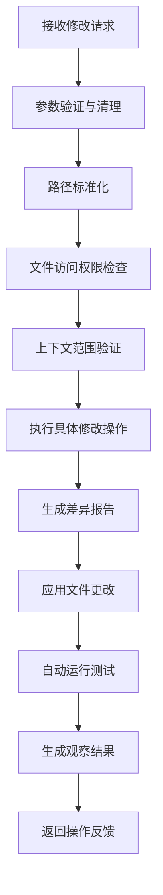

# Moatless Tree Search 文件修改工具功能详解

## 概述

Moatless Tree Search 项目提供了一套完整的文件修改工具，用于自动化代码编辑和修复。这些工具是基于 Action 模式设计的，支持精确的字符串替换、文件创建、行插入等多种操作。本文档将详细介绍这些工具的实现原理、核心代码和使用方式。

## 核心架构

### 1. Action 基础架构

所有文件修改工具都继承自 `Action` 基类，并使用以下 Mixin 来增强功能：

- **CodeModificationMixin**: 提供文件修改的通用功能
- **CodeActionValueMixin**: 提供动作评估和价值计算

```python
class Action(BaseModel):
    """所有动作的基类"""
    args_schema: type[ActionArguments]
    
    def execute(self, args, file_context, workspace) -> Observation:
        """执行动作的核心方法"""
        pass
```

### 2. 文件修改工具分类

项目中的文件修改工具主要分为以下几类：

1. **字符串替换工具** (`StringReplace`)
2. **文件创建工具** (`CreateFile`) 
3. **行插入工具** (`InsertLine`)
4. **字符串追加工具** (`AppendString`)
5. **综合编辑工具** (`ClaudeEditTool`)

## 详细功能分析

### 1. StringReplace - 字符串替换工具

#### 核心功能
`StringReplace` 是最重要的文件修改工具，用于精确的字符串替换操作。

#### 关键特性
- **精确匹配**: 必须完全匹配原始字符串，包括缩进和空白字符
- **唯一性检查**: 确保替换字符串在文件中是唯一的
- **自动缩进修正**: 可以自动修正缩进差异
- **上下文感知**: 只在可见代码范围内进行替换

#### 核心实现代码

```python
class StringReplaceArgs(ActionArguments):
    """字符串替换参数"""
    path: str = Field(..., description="要编辑的文件路径")
    old_str: str = Field(..., description="要替换的精确字符串")
    new_str: str = Field(..., description="替换后的新字符串")
    
    @model_validator(mode="after")
    def validate_args(self) -> "StringReplaceArgs":
        """验证和清理参数"""
        if not self.path.strip():
            raise ValueError("path cannot be empty")
        if not self.old_str.strip():
            raise ValueError("old_str cannot be empty")
        
        # 移除行号和清理字符串
        self.old_str = remove_line_numbers(self.old_str.rstrip("\n"))
        self.new_str = remove_line_numbers(self.new_str.rstrip("\n"))
        return self
```

#### 匹配算法

工具使用多层匹配策略：

1. **精确匹配** (`find_exact_matches`)
```python
def find_exact_matches(old_str: str, file_content: str) -> list[dict]:
    """查找精确匹配"""
    matches = []
    start_pos = 0
    
    while True:
        start_pos = file_content.find(old_str, start_pos)
        if start_pos == -1:
            break
            
        # 计算行号
        start_line = file_content.count("\n", 0, start_pos) + 1
        end_line = start_line + old_str.count("\n")
        
        matches.append({
            "start_line": start_line,
            "end_line": end_line,
            "content": old_str,
            "diff_reason": "exact_match",
        })
        
        start_pos += len(old_str)
    
    return matches
```

2. **缩进差异匹配** (`find_match_when_ignoring_indentation`)
```python
def find_match_when_ignoring_indentation(old_str, content):
    """忽略缩进差异的匹配"""
    old_str_lines = old_str.splitlines()
    content_lines = content.splitlines()
    old_str_no_indent = normalize_indentation(old_str)
    
    window_size = len(old_str_lines)
    indentation_matches = []
    
    for start_idx in range(len(content_lines) - window_size + 1):
        window = "\n".join(content_lines[start_idx : start_idx + window_size])
        window_no_indent = normalize_indentation(window)
        
        if window_no_indent == old_str_no_indent:
            # 计算缩进差异
            differences = []
            indentation_diffs = set()
            
            for i, (old_line, window_line) in enumerate(
                zip(old_str_lines, content_lines[start_idx : start_idx + window_size])
            ):
                old_indent = len(old_line) - len(old_line.lstrip())
                window_indent = len(window_line) - len(window_line.lstrip())
                indent_diff = window_indent - old_indent
                indentation_diffs.add(indent_diff)
                
                if old_indent != window_indent:
                    differences.append(
                        f"Line {i+1}: expected {old_indent} spaces, found {window_indent} spaces"
                    )
            
            # 如果所有行都有相同的缩进差异，可以自动修正
            match_data = {
                "start_line": start_idx + 1,
                "end_line": start_idx + window_size,
                "content": window,
                "diff_reason": "indentation_differs",
                "differences": differences,
            }
            
            if len(indentation_diffs) == 1:
                match_data["uniform_indent_diff"] = indentation_diffs.pop()
                match_data["can_auto_correct"] = True
            
            indentation_matches.append(match_data)
    
    return indentation_matches
```

#### 自动缩进修正

当启用 `auto_correct_indentation` 时，工具可以自动修正缩进差异：

```python
if (
    self.auto_correct_indentation
    and len(potential_matches) == 1
    and potential_matches[0].get("can_auto_correct")
):
    exact_matches = potential_matches
    indent_diff = potential_matches[0]["uniform_indent_diff"]
    
    # 调整新字符串的缩进
    new_str_lines = new_str.splitlines()
    adjusted_lines = []
    for line in new_str_lines:
        if indent_diff < 0:
            # 移除缩进
            current_indent = len(line) - len(line.lstrip())
            spaces_to_remove = min(current_indent, abs(indent_diff))
            adjusted_lines.append(line[spaces_to_remove:])
        else:
            # 添加缩进
            adjusted_lines.append(" " * indent_diff + line)
    new_str = "\n".join(adjusted_lines)
```

### 2. CreateFile - 文件创建工具

#### 核心功能
用于创建新文件，包含完整的文件内容。

#### 实现代码
```python
class CreateFile(Action, CodeActionValueMixin, CodeModificationMixin):
    """文件创建动作"""
    
    def execute(self, args: CreateFileArgs, file_context: FileContext, workspace: Workspace) -> Observation:
        # 路径标准化
        path_str = self.normalize_path(args.path)
        path = Path(path_str)
        
        # 检查文件是否已存在
        if file_context.file_exists(str(path)):
            return Observation(
                message=f"File already exists at: {path}. Cannot overwrite files using create command.",
                properties={"fail_reason": "file_exists"},
            )
        
        # 创建文件并应用内容
        context_file = file_context.add_file(str(path), show_all_spans=True)
        context_file.apply_changes(args.file_text)
        
        # 生成差异报告
        diff = do_diff(str(path), "", args.file_text)
        
        observation = Observation(
            message=f"File created successfully at: {path}",
            properties={"diff": diff, "success": True},
        )
        
        # 自动运行相关测试
        test_summary = self.run_tests(file_path=str(path), file_context=file_context)
        if test_summary:
            observation.message += f"\n\n{test_summary}"
        
        return observation
```

### 3. InsertLine - 行插入工具

#### 核心功能
在文件的指定行号后插入新内容。

#### 关键特性
- **精确行号定位**: 支持在指定行号后插入内容
- **上下文验证**: 确保插入位置在可见代码范围内
- **缩进保持**: 维护正确的代码缩进

#### 实现代码
```python
def execute(self, args: InsertLinesArgs, file_context: FileContext, workspace: Workspace) -> Observation:
    path_str = self.normalize_path(args.path)
    path = Path(path_str)
    
    # 文件存在性检查
    if not file_context.file_exists(str(path)):
        return Observation(
            message=f"File {path} not found.",
            properties={"fail_reason": "file_not_found"},
        )
    
    context_file = file_context.get_context_file(str(path))
    
    # 上下文范围检查
    if not context_file.lines_is_in_context(args.insert_line - 1, args.insert_line):
        return Observation(
            message=f"Line {args.insert_line} is not in the visible portion of file {path}.",
            properties={"fail_reason": "lines_not_in_context"},
            expect_correction=True,
        )
    
    # 执行插入操作
    file_text = context_file.content.expandtabs()
    new_str = args.new_str.expandtabs()
    file_text_lines = file_text.split("\n")
    
    # 行号有效性检查
    if args.insert_line < 0 or args.insert_line > len(file_text_lines):
        return Observation(
            message=f"Invalid `insert_line` parameter: {args.insert_line}.",
            properties={"fail_reason": "invalid_line_number"},
            expect_correction=True,
        )
    
    # 构建新文件内容
    new_str_lines = new_str.split("\n")
    new_file_text_lines = (
        file_text_lines[: args.insert_line]
        + new_str_lines
        + file_text_lines[args.insert_line :]
    )
    
    new_file_text = "\n".join(new_file_text_lines)
    
    # 应用更改并生成差异
    diff = do_diff(str(path), file_text, new_file_text)
    context_file.apply_changes(new_file_text)
    
    return observation
```

### 4. AppendString - 字符串追加工具

#### 核心功能
在文件末尾追加内容，专门用于添加新函数、类或其他代码块。

#### 智能检测
工具会检测内容类型，防止误用：

```python
def execute(self, args: AppendStringArgs, file_context: FileContext, workspace: Workspace) -> Observation:
    # 检测是否为导入语句
    looks_like_import = bool(re.match(r"^(import|from)\s+\w+", new_str.lstrip()))
    
    if looks_like_import:
        return Observation(
            message=(
                "It looks like you're trying to add imports or other top-of-file content. "
                "Please use StringReplace action to add content at the beginning of files."
            ),
            properties={"fail_reason": "wrong_action_for_imports"},
            expect_correction=True,
        )
    
    # 正常追加逻辑
    if file_text:
        file_text = file_text.rstrip("\n")
        new_str = f"\n\n{new_str.lstrip('\n')}"
    else:
        new_str = new_str.lstrip("\n")
    
    new_file_text = file_text + new_str
```

### 5. ClaudeEditTool - 综合编辑工具

#### 核心功能
这是一个综合性的编辑工具，支持多种编辑命令，专门为 Claude AI 设计。

#### 支持的命令
- `view`: 查看文件内容
- `create`: 创建新文件
- `str_replace`: 字符串替换
- `insert`: 行插入
- `undo_edit`: 撤销编辑（未实现）

#### 实现架构
```python
class ClaudeEditTool(Action, CodeModificationMixin):
    """综合编辑工具"""
    
    def __init__(self, code_index: CodeIndex, repository: Repository, completion_model: CompletionModel, **data):
        super().__init__(**data)
        
        # 初始化子工具
        self._str_replace = StringReplace(
            runtime=self._runtime,
            code_index=self._code_index,
            repository=self._repository,
        )
        self._create_file = CreateFile(
            runtime=self._runtime,
            code_index=self._code_index,
            repository=self._repository,
        )
        self._view_code = ViewCode(
            repository=self._repository, 
            completion_model=completion_model
        )
    
    def execute(self, args: EditActionArguments, file_context: FileContext, workspace: Workspace) -> Observation:
        # 路径标准化
        if args.path.startswith("/repo"):
            args.path = args.path[5:]
        if args.path.startswith("/"):
            args.path = args.path[1:]
        
        path = Path(args.path)
        
        # 路径验证
        validation_error = self.validate_path(file_context, args.command, path)
        if validation_error:
            return Observation(
                message=validation_error,
                properties={"fail_reason": "invalid_path"},
                expect_correction=True,
            )
        
        # 根据命令分发到相应的子工具
        if args.command == "view":
            return self._view(file_context, path, args)
        elif args.command == "create":
            return self._create_file.execute(CreateFileArgs(...), file_context)
        elif args.command == "str_replace":
            return self._str_replace.execute(StringReplaceArgs(...), file_context)
        elif args.command == "insert":
            return self._insert(file_context, path, args.insert_line, args.new_str)
```

## 通用功能组件

### 1. CodeModificationMixin

这个 Mixin 为所有文件修改工具提供通用功能：

```python
class CodeModificationMixin:
    """代码修改通用功能 Mixin"""
    
    def normalize_path(self, file_path: str) -> str:
        """标准化文件路径"""
        if file_path.startswith("/repo"):
            file_path = file_path[5:]
        if file_path.startswith("/"):
            file_path = file_path[1:]
        return file_path
    
    def validate_file_access(self, file_path: str, file_context: FileContext) -> Tuple[Optional[Path], Optional[Observation]]:
        """验证文件访问权限"""
        path = Path(file_path)
        
        if not file_context.file_exists(str(path)):
            return None, Observation(
                message=f"File {path} not found.",
                properties={"fail_reason": "file_not_found"},
            )
        
        if not file_context.has_file(str(path)):
            return None, Observation(
                message=f"You have not yet viewed the file {path}. Use ViewCode to view the parts of the file that you want to modify.",
                properties={"fail_reason": "file_not_in_context"},
            )
        
        return path, None
    
    def run_tests(self, file_path: str, file_context: FileContext) -> str:
        """自动运行相关测试"""
        if not file_context.has_runtime:
            return ""
        
        # 如果是测试文件，直接添加
        if file_context.file_exists(file_path) and is_test(file_path):
            file_context.add_test_file(file_path)
        elif self._code_index:
            # 查找相关测试文件
            search_results = self._code_index.find_test_files(
                file_path, query=file_path, max_results=2, max_spans=2
            )
            
            for search_result in search_results:
                file_context.add_test_file(search_result.file_path)
        
        # 运行测试
        file_context.run_tests()
        
        # 生成测试报告
        response_msg = f"Running tests for the following files:\n"
        for test_file in file_context.test_files:
            response_msg += f"* {test_file.file_path}\n"
        
        failure_details = file_context.get_test_failure_details()
        if failure_details:
            response_msg += f"\n{failure_details}"
        
        summary = f"\n{file_context.get_test_summary()}"
        response_msg += summary
        
        return response_msg
```

### 2. 差异生成和应用

所有修改工具都使用统一的差异生成和应用机制：

```python
from moatless.repository.file import do_diff

# 生成差异
diff = do_diff(str(path), original_content, new_content)

# 应用更改
context_file.apply_changes(new_content)

# 在观察结果中包含差异
observation = Observation(
    message=success_message,
    properties={"diff": diff, "success": True},
)
```

## AI 提示词集成

### 1. 工作流程提示词

系统使用动态生成的提示词来指导 AI 使用这些工具：

```python
def generate_workflow_prompt(actions, has_runtime: bool = False) -> str:
    """根据可用动作生成工作流程提示词"""
    
    # 定义修改动作描述
    modify_descriptions = {
        "StringReplace": "Replace exact text strings in files with new content",
        "CreateFile": "Create new files with specified content",
        "InsertLine": "Insert new lines at specific positions in files",
        "AppendString": "Add content to the end of files",
        "ClaudeEditTool": "Make complex code edits using natural language instructions",
    }
    
    prompt = """
# Workflow Overview

1. **Understand the Task**
  * Review the task provided in <task>
  * Identify which code needs to change
  * Determine what additional context is needed

2. **Locate Code**
  * Use search functions to find relevant code
  * Use ViewCode for specific code sections

3. **Modify Code**
  * Apply Changes:"""
    
    for action in actions:
        action_name = action.__class__.__name__
        if action_name in modify_descriptions:
            prompt += f"\n    * {action_name} - {modify_descriptions[action_name]}"
    
    if has_runtime:
        prompt += """
  * Tests Run Automatically: Tests execute after code changes

4. **Update Tests**
  * Find and modify test files
  * Add new test cases for added functionality
  * Tests execute automatically after modifications"""
    
    return prompt
```

### 2. ReAct 模式集成

工具与 ReAct (Reasoning and Acting) 模式深度集成：

```python
REACT_TOOLS_PROMPT = """
You will write your reasoning steps inside `<thoughts>` tags, and then perform actions by making function calls as needed. 
After each action, you will receive an Observation that contains the result of your action. Use these observations to inform your next steps.

## How to Interact

- **Think Step by Step:** Use the ReAct pattern to reason about the task. Document each thought process within `<thoughts>`.
- **Function Calls:** After your thoughts, make the necessary function calls to interact with the codebase or environment.
- **Observations:** After each function call, you will receive an Observation containing the result. Use this information to plan your next step.
- **One Action at a Time:** Only perform one action before waiting for its Observation.
"""
```

### 3. 错误处理和用户指导

系统提供详细的错误信息和修正建议：

```python
# StringReplace 中的错误处理示例
if len(exact_matches) == 0:
    if len(potential_matches) == 1:
        match = potential_matches[0]
        match_content = match["content"]
        
        message = (
            f"No changes were made. The provided old_str was not found, but a similar code block was found. "
            f"To replace this code, the old_str must match exactly:\n\n```\n{match_content}\n```\n\n"
        )
        
        if match["diff_reason"] == "indentation_differs":
            differences_msg = "\n".join(f"- {diff}" for diff in match.get("differences", []))
            message += (
                f"The content matches but the indentation is different.\n"
                f"{differences_msg}\n\n"
                f"Please update old_str to match the exact indentation shown above."
            )
        
        return Observation(
            message=message,
            properties={"flags": [match["diff_reason"]]},
            expect_correction=True,
        )
```

## 测试集成

### 1. 自动测试运行

所有文件修改工具都集成了自动测试功能：

```python
def run_tests(self, file_path: str, file_context: FileContext) -> str:
    """运行相关测试"""
    if not file_context.has_runtime:
        return ""
    
    # 添加测试文件
    if is_test(file_path):
        file_context.add_test_file(file_path)
    elif self._code_index:
        # 查找相关测试
        search_results = self._code_index.find_test_files(file_path, query=file_path, max_results=2, max_spans=2)
        for search_result in search_results:
            file_context.add_test_file(search_result.file_path)
    
    # 运行测试
    file_context.run_tests()
    
    # 返回测试结果摘要
    return file_context.get_test_summary()
```

### 2. 测试结果反馈

测试结果会自动包含在操作观察中：

```python
observation = Observation(
    message=success_message,
    properties={"diff": diff, "success": True},
)

test_summary = self.run_tests(file_path=str(path), file_context=file_context)
if test_summary:
    observation.message += f"\n\n{test_summary}"

return observation
```

## 使用示例

### 1. 字符串替换示例

```python
# 使用 StringReplace 修改函数
action = StringReplace()
args = StringReplaceArgs(
    path="auth/validator.py",
    old_str="""def validate_user(username, password):
    if len(username) < 3:
        return False
    if len(password) < 8:
        return False
    return True""",
    new_str="""def validate_user(username, password):
    if len(username) < 3 or not is_valid_email(username):
        return False
    if len(password) < 12 or not has_special_chars(password):
        return False
    if not has_numbers(password):
        return False
    return True"""
)

observation = action.execute(args, file_context, workspace)
```

### 2. 文件创建示例

```python
# 使用 CreateFile 创建新文件
action = CreateFile()
args = CreateFileArgs(
    path="auth/user_auth.py",
    file_text="""import logging
from typing import Optional

logger = logging.getLogger(__name__)

class UserAuth:
    def __init__(self):
        self._users = {}

    def authenticate(self, username: str, password: str) -> bool:
        if username not in self._users:
            logger.warning(f"Authentication failed: User {username} not found")
            return False
        return self._users[username] == password"""
)

observation = action.execute(args, file_context, workspace)
```

### 3. 行插入示例

```python
# 使用 InsertLine 添加新方法
action = InsertLine()
args = InsertLinesArgs(
    path="models/user.py",
    insert_line=15,
    new_str="""    def update_preferences(self, preferences: dict) -> None:
        self._preferences.update(preferences)
        self._last_updated = datetime.now(timezone.utc)
        logger.info(f"Updated preferences for user {self.username}")"""
)

observation = action.execute(args, file_context, workspace)
```

## 修改流程逻辑详解

### 1. 整体修改流程架构

文件修改在 Moatless Tree Search 中遵循严格的流程控制，确保每次修改都是安全、可追踪和可验证的。



### 2. 详细流程步骤分析

#### 步骤1: 参数验证与清理

每个修改工具都会首先验证输入参数：

```python
@model_validator(mode="after")
def validate_args(self) -> "StringReplaceArgs":
    """参数验证流程"""
    # 1. 基础验证
    if not self.path.strip():
        raise ValueError("path cannot be empty")
    if not self.old_str.strip():
        raise ValueError("old_str cannot be empty")
    
    # 2. 内容清理 - 移除行号标记
    def remove_line_numbers(text: str) -> str:
        lines = text.split("\n")
        line_number_pattern = r"^\s*(\d+)\t*"
        
        # 检查是否所有行都以行号开头
        if not all(re.match(line_number_pattern, line) for line in lines):
            return text
        
        # 清理行号但保留缩进
        cleaned_lines = []
        for line in lines:
            cleaned_line = re.sub(line_number_pattern, "", line)
            cleaned_lines.append(cleaned_line)
        
        return "\n".join(cleaned_lines)
    
    # 3. 应用清理
    self.old_str = remove_line_numbers(self.old_str.rstrip("\n"))
    self.new_str = remove_line_numbers(self.new_str.rstrip("\n"))
    
    return self
```

#### 步骤2: 路径标准化

统一处理不同格式的文件路径：

```python
def normalize_path(self, file_path: str) -> str:
    """路径标准化流程"""
    # 1. 移除 /repo 前缀（Claude 常添加）
    if file_path.startswith("/repo"):
        file_path = file_path[5:]
    
    # 2. 移除开头的斜杠
    if file_path.startswith("/"):
        file_path = file_path[1:]
    
    # 3. 返回标准化路径
    return file_path
```

#### 步骤3: 文件访问权限检查

确保文件存在且在当前上下文中：

```python
def validate_file_access(self, file_path: str, file_context: FileContext) -> Tuple[Optional[Path], Optional[Observation]]:
    """文件访问验证流程"""
    path = Path(file_path)
    
    # 1. 检查文件是否存在
    if not file_context.file_exists(str(path)):
        return None, Observation(
            message=f"File {path} not found.",
            properties={"fail_reason": "file_not_found"},
        )
    
    # 2. 检查文件是否在当前上下文中
    if not file_context.has_file(str(path)):
        return None, Observation(
            message=f"You have not yet viewed the file {path}. Use ViewCode to view the parts of the file that you want to modify.",
            properties={"fail_reason": "file_not_in_context"},
        )
    
    return path, None
```

#### 步骤4: 上下文范围验证

确保修改位置在可见代码范围内：

```python
# 在 InsertLine 中的示例
if not context_file.lines_is_in_context(args.insert_line - 1, args.insert_line):
    return Observation(
        message=f"Line {args.insert_line} is not in the visible portion of file {path}. Please provide a line number within the visible code, use ViewCode to see the code.",
        properties={"fail_reason": "lines_not_in_context"},
        expect_correction=True,
    )
```

#### 步骤5: 执行具体修改操作

根据不同工具类型执行相应的修改逻辑：

**StringReplace 的修改流程：**

```python
def execute_string_replace(self, args, file_context):
    """字符串替换的详细执行流程"""
    
    # 1. 获取文件内容并标准化
    context_file = file_context.get_context_file(str(path))
    file_content = context_file.content.expandtabs()
    old_str = args.old_str.expandtabs()
    new_str = args.new_str.expandtabs()
    
    # 2. 检查是否为无效操作
    if old_str == new_str:
        return Observation(
            message="The old_str and new_str are the same. No changes were made.",
            properties={"fail_reason": "no_changes"},
        )
    
    # 3. 多层匹配策略
    # 3.1 精确匹配
    exact_matches = find_exact_matches(old_str, file_content)
    
    # 3.2 过滤上下文内的匹配
    in_context_exact_matches = [
        match for match in exact_matches
        if context_file.lines_is_in_context(match["start_line"], match["end_line"])
    ]
    
    # 3.3 处理匹配结果
    if len(exact_matches) == 0:
        # 尝试缩进差异匹配
        potential_matches = find_match_when_ignoring_indentation(old_str, file_content)
        
        # 自动缩进修正逻辑
        if (self.auto_correct_indentation 
            and len(potential_matches) == 1 
            and potential_matches[0].get("can_auto_correct")):
            
            # 执行自动修正
            exact_matches = potential_matches
            indent_diff = potential_matches[0]["uniform_indent_diff"]
            
            # 调整新字符串缩进
            new_str = self.adjust_indentation(new_str, indent_diff)
            
        else:
            # 返回详细错误信息
            return self.generate_error_observation(potential_matches, old_str, file_content)
    
    elif len(exact_matches) > 1:
        # 处理多重匹配
        return self.handle_multiple_matches(exact_matches)
    
    # 4. 执行替换
    if "targeted_in_context_replacement" in properties.get("flags", []):
        # 精确位置替换
        new_file_content = self.targeted_replace(file_content, old_str, new_str, match_info)
    else:
        # 全局替换
        new_file_content = file_content.replace(old_str, new_str)
    
    return new_file_content
```

#### 步骤6: 生成差异报告

使用统一的差异生成机制：

```python
from moatless.repository.file import do_diff

def generate_diff_report(self, path, original_content, new_content):
    """生成差异报告"""
    # 1. 生成 Git 格式的差异
    diff = do_diff(str(path), original_content, new_content)
    
    # 2. 创建代码片段预览
    snippet_start_line = max(0, start_line - SNIPPET_LINES - 1)
    end_line = start_line + SNIPPET_LINES + new_str.count("\n")
    snippet = "\n".join(new_content.split("\n")[snippet_start_line:end_line])
    
    # 3. 格式化带行号的片段
    snippet_with_lines = self.format_snippet_with_lines(snippet, start_line + 1)
    
    return diff, snippet_with_lines
```

#### 步骤7: 应用文件更改

将更改应用到文件上下文：

```python
def apply_changes(self, context_file, new_content, diff):
    """应用文件更改"""
    # 1. 更新文件内容
    context_file.apply_changes(new_content)
    
    # 2. 标记文件已被编辑
    context_file.was_edited = True
    
    # 3. 更新缓存
    context_file._cached_content = None
    context_file._cached_module = None
    
    # 4. 记录差异
    context_file.patch = diff
```

#### 步骤8: 自动运行测试

修改完成后自动执行相关测试：

```python
def run_tests(self, file_path: str, file_context: FileContext) -> str:
    """自动测试执行流程"""
    if not file_context.has_runtime:
        return ""
    
    # 1. 识别测试文件
    test_files = []
    
    # 1.1 如果修改的就是测试文件
    if file_context.file_exists(file_path) and is_test(file_path):
        test_files.append(file_path)
    
    # 1.2 查找相关测试文件
    elif self._code_index:
        search_results = self._code_index.find_test_files(
            file_path, query=file_path, max_results=2, max_spans=2
        )
        test_files.extend([result.file_path for result in search_results])
    
    # 2. 添加测试文件到上下文
    for test_file in test_files:
        file_context.add_test_file(test_file)
    
    # 3. 执行测试
    file_context.run_tests()
    
    # 4. 生成测试报告
    response_msg = f"Running tests for the following files:\n"
    for test_file in file_context.test_files:
        response_msg += f"* {test_file.file_path}\n"
    
    # 5. 包含失败详情
    failure_details = file_context.get_test_failure_details()
    if failure_details:
        response_msg += f"\n{failure_details}"
    
    # 6. 添加测试摘要
    summary = f"\n{file_context.get_test_summary()}"
    response_msg += summary
    
    return response_msg
```

#### 步骤9: 生成观察结果

创建包含所有相关信息的观察对象：

```python
def generate_observation(self, success_message, diff, test_summary, properties=None):
    """生成观察结果"""
    # 1. 创建基础观察
    observation = Observation(
        message=success_message,
        summary=f"File modification completed successfully",
        properties=properties or {},
    )
    
    # 2. 添加差异信息
    if diff:
        observation.properties["diff"] = diff
        observation.properties["success"] = True
    
    # 3. 包含测试结果
    if test_summary:
        observation.message += f"\n\n{test_summary}"
    
    # 4. 设置期望修正标志（如果需要）
    if properties and properties.get("fail_reason"):
        observation.expect_correction = True
    
    return observation
```

### 3. 错误处理和恢复流程

#### 3.1 匹配失败处理

```python
def handle_match_failure(self, old_str, file_content, potential_matches):
    """处理匹配失败的情况"""
    
    if len(potential_matches) == 1:
        match = potential_matches[0]
        match_content = match["content"]
        
        # 生成详细的错误信息
        message = (
            f"No changes were made. The provided old_str was not found, but a similar code block was found. "
            f"To replace this code, the old_str must match exactly:\n\n```\n{match_content}\n```\n\n"
        )
        
        # 根据差异类型提供具体建议
        if match["diff_reason"] == "indentation_differs":
            differences_msg = "\n".join(f"- {diff}" for diff in match.get("differences", []))
            message += (
                f"The content matches but the indentation is different.\n"
                f"{differences_msg}\n\n"
                f"Please update old_str to match the exact indentation shown above."
            )
        elif match["diff_reason"] == "line_breaks_differ":
            message += f"Differences found:\n{differences_msg}\n\n"
            message += "Please update old_str to match the exact line breaks and other special characters as shown above."
        
        return Observation(
            message=message,
            properties={"flags": [match["diff_reason"]]},
            expect_correction=True,
        )
    
    elif len(potential_matches) > 1:
        # 多重潜在匹配
        matches_info = "\n".join(
            f"- Lines {m['start_line']}-{m['end_line']} ({m['diff_reason']}):\n```\n{m['content']}\n```"
            for m in potential_matches
        )
        return Observation(
            message=f"Multiple potential matches found with different formatting:\n{matches_info}\nTry including more surrounding context to create a unique match.",
            properties={"flags": ["multiple_potential_occurrences"]},
            expect_correction=True,
        )
    
    # 完全没有找到匹配
    return Observation(
        message=f"String '{old_str}' not found in {path}.\n\nRemember to write out the exact string you want to replace with the same indentation and no placeholders.",
        properties={"fail_reason": "string_not_found"},
        expect_correction=True,
    )
```

#### 3.2 测试失败处理

```python
def handle_test_failure(self, file_context, test_results):
    """处理测试失败的情况"""
    
    failure_details = file_context.get_test_failure_details()
    
    if failure_details:
        # 分析失败原因
        failure_analysis = self.analyze_test_failures(failure_details)
        
        # 生成修复建议
        suggestions = self.generate_fix_suggestions(failure_analysis)
        
        return {
            "status": "test_failed",
            "details": failure_details,
            "analysis": failure_analysis,
            "suggestions": suggestions
        }
    
    return {"status": "test_passed"}
```

### 4. 状态管理和追踪

#### 4.1 文件状态追踪

```python
class ContextFile:
    """文件上下文状态管理"""
    
    def __init__(self, file_path: str):
        self.file_path = file_path
        self.was_edited = False  # 是否被编辑
        self.was_viewed = False  # 是否被查看
        self.patch = None        # 最新的差异
        self.accumulated_patch = None  # 累积的差异
    
    def apply_changes(self, new_content: str):
        """应用更改并更新状态"""
        old_content = self.content
        
        # 1. 更新内容
        self._content = new_content
        
        # 2. 生成差异
        self.patch = do_diff(self.file_path, old_content, new_content)
        
        # 3. 更新状态标志
        self.was_edited = True
        
        # 4. 清理缓存
        self._cached_content = None
        self._cached_module = None
```

#### 4.2 操作历史记录

```python
class FileContext:
    """文件上下文管理"""
    
    def generate_git_patch(self, ignore_tests: bool = False) -> str:
        """生成完整的 Git 补丁"""
        patches = []
        
        for file_path, context_file in self._files.items():
            if context_file.was_edited and context_file.patch:
                if ignore_tests and is_test(file_path):
                    continue
                patches.append(context_file.patch)
        
        return "\n".join(patches)
    
    def get_edited_files(self) -> List[str]:
        """获取已编辑文件列表"""
        return [
            file_path for file_path, file in self._files.items()
            if file.was_edited and not file.is_new
        ]
    
    def was_edited(self) -> bool:
        """检查是否有文件被编辑"""
        return any(file.was_edited for file in self._files.values())
```

### 5. 并发和安全控制

#### 5.1 操作原子性

```python
def atomic_file_operation(self, operation_func, *args, **kwargs):
    """确保文件操作的原子性"""
    # 1. 创建备份
    backup_content = self.create_backup()
    
    try:
        # 2. 执行操作
        result = operation_func(*args, **kwargs)
        
        # 3. 验证结果
        if not self.validate_operation_result(result):
            raise OperationValidationError("Operation result validation failed")
        
        return result
        
    except Exception as e:
        # 4. 发生错误时恢复
        self.restore_from_backup(backup_content)
        raise e
    
    finally:
        # 5. 清理备份
        self.cleanup_backup(backup_content)
```

#### 5.2 上下文边界控制

```python
def enforce_context_boundaries(self, file_path: str, start_line: int, end_line: int) -> bool:
    """强制执行上下文边界"""
    context_file = self.get_context_file(file_path)
    
    if not context_file:
        return False
    
    # 检查行范围是否在可见上下文中
    if not context_file.lines_is_in_context(start_line, end_line):
        logger.warning(f"Lines {start_line}-{end_line} are not in context for {file_path}")
        return False
    
    return True
```

## 总结

Moatless Tree Search 的文件修改工具系统具有以下特点：

1. **模块化设计**: 每个工具都有明确的职责和用途
2. **精确控制**: 支持精确的字符串匹配和位置定位
3. **智能错误处理**: 提供详细的错误信息和修正建议
4. **自动测试集成**: 修改后自动运行相关测试
5. **AI 友好**: 与 ReAct 模式和提示词系统深度集成
6. **上下文感知**: 只在可见代码范围内进行操作
7. **差异跟踪**: 完整的变更历史和差异报告
8. **流程控制**: 严格的多步骤验证和执行流程
9. **状态管理**: 完整的文件状态追踪和历史记录
10. **安全保障**: 原子性操作和边界控制机制

这些工具为自动化代码修复和编辑提供了强大而可靠的基础设施，通过严格的流程控制和智能的错误处理，确保每次修改都是安全、准确和可追踪的，是 Moatless Tree Search 系统实现智能代码修改的核心组件。