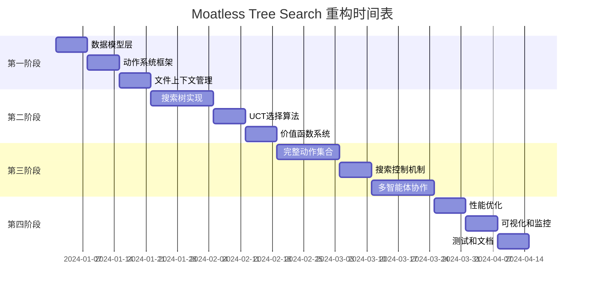

# Moatless Tree Search 项目重构建议说明书

## 项目概述

Moatless Tree Search 是一个基于蒙特卡洛树搜索（MCTS）的软件工程自动化框架，专门用于代码修复和bug修复任务。本文档提供了项目重构的详细建议，帮助开发者系统性地重新构建这个复杂的AI驱动系统。

## 当前项目状态分析

### 现有优势
- ✅ 完整的需求文档和设计规范
- ✅ 清晰的架构设计和组件划分
- ✅ 详细的任务分解和实现计划
- ✅ 成熟的技术栈选择（Pydantic, LiteLLM, NetworkX等）

### 重构必要性
- 🔄 代码结构需要优化，提高可维护性
- 🔄 组件间耦合度较高，需要解耦
- 🔄 缺乏渐进式开发路径
- 🔄 测试覆盖率需要提升

## 重构策略：分层递进式构建

### 核心原则

1. **最小可行产品（MVP）优先**
   - 先实现核心功能，后添加增强特性
   - 保持系统始终处于可运行状态
   - 快速验证核心算法的有效性

2. **模块化设计**
   - 组件间低耦合，高内聚
   - 清晰的接口定义
   - 支持独立开发和测试

3. **测试驱动开发**
   - 每个组件都有对应的单元测试
   - 集成测试覆盖关键流程
   - 持续集成确保代码质量

4. **渐进式交付**
   - 分阶段交付可用功能
   - 每个阶段都有明确的验收标准
   - 支持快速迭代和反馈

## 重构实施计划

### 第一阶段：核心基础设施 (Foundation Layer)
**时间估算：2-3周**
**优先级：🔴 最高**

#### 1.1 数据模型层
```
目标：建立系统的数据基础
交付物：
- Node 类及其完整数据模型
- Action、Observation、Reward 基础模型
- Pydantic 验证体系
- 基础序列化/反序列化功能

验收标准：
- 所有数据模型通过类型检查
- 支持JSON序列化和反序列化
- 基础单元测试覆盖率 > 90%
```

#### 1.2 动作系统框架
```
目标：建立可扩展的动作执行框架
交付物：
- Action 基类和注册机制
- 基础动作实现（ViewCode, FindFunction）
- 动作执行的标准化流程
- 错误处理机制

验收标准：
- 支持动态注册新动作类型
- 动作执行结果标准化
- 异常情况得到妥善处理
```

#### 1.3 文件上下文管理
```
目标：建立代码理解和操作的基础
交付物：
- FileContext 类实现
- Repository 基础功能
- 代码索引和搜索基础设施
- Git 操作集成

验收标准：
- 支持多种代码文件格式
- 基础代码搜索功能可用
- Git 操作稳定可靠
```

### 第二阶段：搜索算法核心 (Algorithm Core)
**时间估算：3-4周**
**优先级：🟡 高**

#### 2.1 搜索树实现
```
目标：实现MCTS的核心数据结构
交付物：
- SearchTree 类完整实现
- 树的创建、遍历、状态管理
- 节点访问计数和奖励更新
- 搜索轨迹记录

验收标准：
- 支持大规模搜索树（>1000节点）
- 树操作性能满足要求
- 状态持久化功能正常
```

#### 2.2 UCT选择算法
```
目标：实现智能的节点选择策略
交付物：
- UCT 分数计算引擎
- BestFirstSelector 实现
- 探索-利用平衡机制
- 多样性奖励计算

验收标准：
- UCT 算法数学正确性验证
- 选择策略有效性测试
- 性能基准测试通过
```

#### 2.3 价值函数系统
```
目标：建立节点价值评估机制
交付物：
- ValueFunction 基础框架
- 代码质量评估器
- 测试结果评估器
- 多维度评分机制

验收标准：
- 评估结果与人工评估相关性 > 0.8
- 评估速度满足实时要求
- 支持自定义评估维度
```

### 第三阶段：完整功能实现 (Feature Complete)
**时间估算：4-5周**
**优先级：🟢 中**

#### 3.1 完整动作集合
```
目标：实现所有必需的代码操作动作
交付物：
- 查找动作（FindClass, FindCodeSnippet, SemanticSearch）
- 修改动作（StringReplace, CreateFile, AppendString）
- 测试动作（RunTests）
- 控制动作（Finish, Reject）

验收标准：
- 所有动作类型功能完整
- 安全性检查机制完善
- 错误处理覆盖所有异常情况
```

#### 3.2 搜索控制机制
```
目标：实现智能的搜索控制和终止
交付物：
- 迭代控制系统
- 质量阈值控制
- 完成状态管理
- 成本限制监控

验收标准：
- 搜索能够在合理时间内终止
- 资源使用得到有效控制
- 搜索质量满足预期
```

#### 3.3 多智能体协作
```
目标：实现智能体间的协作机制
交付物：
- AgentDiscriminator 投票机制
- FeedbackGenerator 反馈系统
- 智能体协调机制
- 贡献度跟踪

验收标准：
- 多智能体协作提升解决方案质量
- 协作开销控制在合理范围
- 协作结果可解释和追踪
```

### 第四阶段：优化和增强 (Enhancement)
**时间估算：2-3周**
**优先级：🔵 低**

#### 4.1 性能优化
```
目标：提升系统性能和资源利用率
交付物：
- 相似度计算缓存
- 搜索状态持久化
- 内存管理优化
- 并发处理支持

验收标准：
- 搜索速度提升 > 50%
- 内存使用优化 > 30%
- 支持多线程并发搜索
```

#### 4.2 可视化和监控
```
目标：提供直观的系统监控和调试工具
交付物：
- 节点状态标识系统
- 搜索轨迹可视化
- ASCII 树状图生成
- 性能监控面板

验收标准：
- 可视化界面直观易用
- 实时监控数据准确
- 调试信息完整有用
```

#### 4.3 测试和文档
```
目标：完善测试覆盖和文档体系
交付物：
- 完整的单元测试套件
- 集成测试和端到端测试
- API 文档和使用指南
- 性能基准测试

验收标准：
- 测试覆盖率 > 95%
- 文档完整性和准确性
- 性能基准数据可重现
```

## 技术实施细节

### 开发环境配置

```bash
# 1. 创建虚拟环境
poetry install --with dev

# 2. 配置开发工具
poetry run pre-commit install

# 3. 运行测试
poetry run pytest

# 4. 代码质量检查
poetry run ruff check
poetry run mypy moatless/
```

### 代码组织结构

```
moatless/
├── core/                   # 核心数据模型和基础设施
│   ├── models.py          # Node, Action, Reward 等基础模型
│   ├── registry.py        # 动作注册和发现机制
│   └── exceptions.py      # 自定义异常类型
├── search/                # 搜索算法实现
│   ├── tree.py           # SearchTree 主要实现
│   ├── selector/         # 节点选择策略
│   └── value_function/   # 价值函数实现
├── actions/              # 动作实现
│   ├── base.py          # Action 基类
│   ├── search/          # 搜索类动作
│   ├── modify/          # 修改类动作
│   └── control/         # 控制类动作
├── agents/              # 智能体实现
│   ├── discriminator.py # 判别器
│   └── feedback.py      # 反馈生成器
├── repository/          # 代码仓库管理
├── index/              # 代码索引和搜索
├── visualization/      # 可视化组件
└── utils/             # 工具函数
```

### 质量保证措施

#### 代码质量
- **静态分析**：使用 Ruff 进行代码风格检查
- **类型检查**：使用 MyPy 进行类型验证
- **测试覆盖**：使用 Coverage 监控测试覆盖率
- **文档生成**：使用 Sphinx 自动生成 API 文档

#### 性能监控
- **基准测试**：建立性能基准和回归测试
- **内存分析**：使用 memory_profiler 监控内存使用
- **性能分析**：使用 cProfile 分析性能瓶颈

#### 持续集成
- **自动化测试**：GitHub Actions 运行完整测试套件
- **代码审查**：强制代码审查流程
- **自动部署**：自动化包发布到 PyPI

## 风险评估和缓解策略

### 技术风险

| 风险项 | 影响程度 | 发生概率 | 缓解策略 |
|--------|----------|----------|----------|
| MCTS算法复杂度过高 | 高 | 中 | 分阶段实现，先简化后优化 |
| LLM集成不稳定 | 中 | 高 | 实现重试机制和降级策略 |
| 性能不满足要求 | 中 | 中 | 早期性能测试，及时优化 |
| 内存使用过高 | 中 | 中 | 实现内存管理和清理机制 |

### 项目风险

| 风险项 | 影响程度 | 发生概率 | 缓解策略 |
|--------|----------|----------|----------|
| 开发周期延长 | 高 | 中 | MVP优先，分阶段交付 |
| 需求变更频繁 | 中 | 高 | 模块化设计，降低变更影响 |
| 团队协作困难 | 中 | 低 | 清晰的接口定义和文档 |

## 成功标准和验收指标

### 功能指标
- ✅ 核心MCTS算法正确实现
- ✅ 支持所有必需的代码操作动作
- ✅ 多智能体协作机制有效
- ✅ 搜索结果质量满足预期

### 性能指标
- ✅ 单次搜索时间 < 5分钟
- ✅ 内存使用 < 2GB
- ✅ 测试覆盖率 > 95%
- ✅ 代码质量评分 > 8.0/10

### 可用性指标
- ✅ API文档完整准确
- ✅ 安装和配置简单
- ✅ 错误信息清晰有用
- ✅ 可视化界面直观

## 实施时间表



## 下一步行动

### 立即行动项
1. **环境准备**：配置开发环境和工具链
2. **团队对齐**：确保团队理解重构计划和目标
3. **基础设施**：建立代码仓库和CI/CD流程

### 第一周目标
1. 完成数据模型层的设计和实现
2. 建立基础的测试框架
3. 实现第一个可运行的MVP版本

### 里程碑检查点
- **第2周**：核心数据模型完成
- **第4周**：基础动作系统可用
- **第6周**：搜索树核心功能完成
- **第10周**：完整功能实现
- **第12周**：优化和文档完成

## 总结

这个重构计划采用分层递进的方式，确保每个阶段都有明确的目标和可验证的交付物。通过MVP优先的策略，我们可以快速验证核心概念，降低项目风险。模块化的设计使得团队可以并行开发，提高开发效率。

重构的成功关键在于：
1. **严格按照计划执行**，避免功能蔓延
2. **持续测试和验证**，确保质量
3. **及时沟通和调整**，应对变化
4. **文档和知识传承**，确保可维护性

通过这个重构计划，我们将构建一个高质量、高性能、易维护的Moatless Tree Search系统。